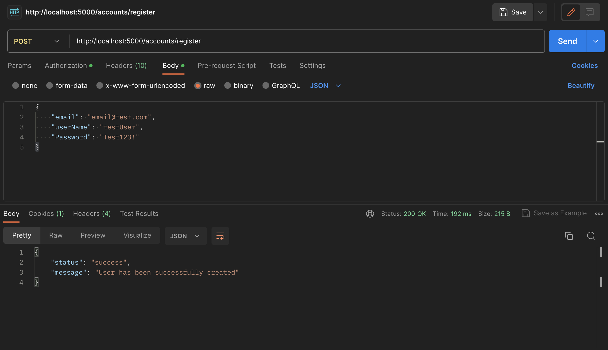
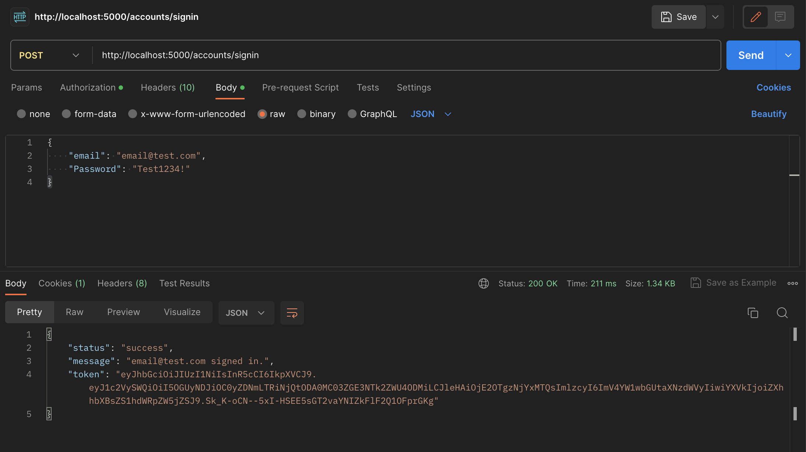
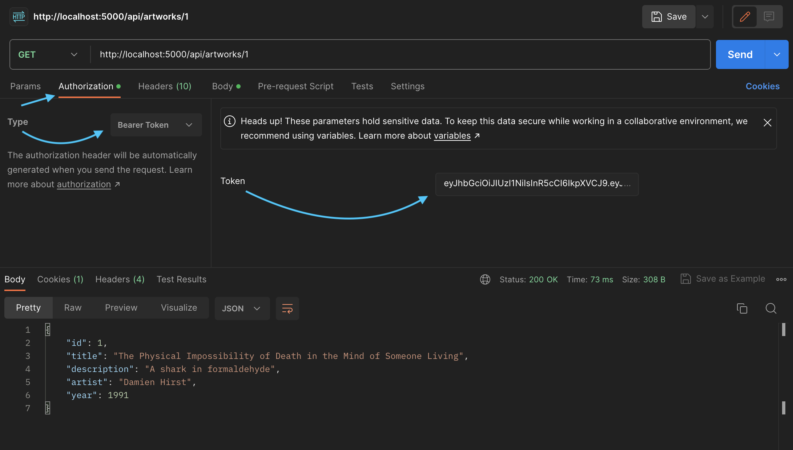

# Art Gallery

## Technologies Used
* _Github_
* _VSCode_
* _C#_
* _.NET_
* _CSHTML_
* _JSON_
* _MySQL Workbench_
* _Swagger_
* _Postman_

------------------------------

## Prerequisites

* _MySQL_
* _MySQL Workbench_
* _Entity Framework Core_
* _Postman_

#### Install MySQL Workbench
 [MySQL Workbench](https://dev.mysql.com/downloads/workbench/).

#### Install Postman
(Optional) [Download and install Postman](https://www.postman.com/downloads/).

------------------------------

## Application Setup

1. Clone this repo.
2. Open the terminal and navigate to this project's production directory called "ArtGallery".
3. Within the production directory "ArtGallery", create two new files: `appsettings.json` and `appsettings.Development.json`.
4. Within `appsettings.json`, put in the following code. Make sure to replace the `uid` and `pwd` values in the MySQL database connection string with your own username and password for MySQL.

```json
{
  "Logging": {
    "LogLevel": {
      "Default": "Information",
      "Microsoft.AspNetCore": "Warning"
    }
  },
  "AllowedHosts": "*",
  "ConnectionStrings": {
    "DefaultConnection": "Server=localhost;Port=3306;database={YOUR_DATABASE};uid={USERNAME};pwd={PASSWORD};"
  }
}
```

5. Within `appsettings.Development.json`, add the following code:

```json
{
  "Logging": {
    "LogLevel": {
      "Default": "Information",
      "Microsoft": "Trace",
      "Microsoft.AspNetCore": "Information",
      "Microsoft.Hosting.Lifetime": "Information"
    }
  }
}
```

6. Open your shell (e.g., Terminal or GitBash) to the production directory "ArtGallery", and run `dotnet ef database update`.
    > To optionally create a migration, run the command `dotnet ef migrations add MigrationName` where `MigrationName` is your custom name for the migration in UpperCamelCase. 
7. Within the production directory "ArtGallery", run `dotnet watch run --launch-profile "ArtGallery-Production"` in the command line to start the project in production mode with a watcher. 
8. To optionally further build out this project in development mode, start the project with `dotnet watch run` in the production directory "ArtGallery".
9. Use your program of choice to make API calls. In your API calls, use the domain _http://localhost:5000_. Keep reading to learn about all of the available endpoints.

------------------------------

## 🛰️ API Documentation
Explore the API endpoints in Postman or a browser.

### Using Swagger Documentation 
To explore Art Gallery with NSwag, launch the project using `dotnet run` with the Terminal or Powershell, and input the following URL into your browser: `http://localhost:5000/swagger`

## Generating a JSON Web Token
In order to be authorized to use the `POST`, `PUT`, and `DELETE` functionality of the API, you are required to authenticate yourself through Postman with a JSON Web Token (JWT).

------------------------------

> ### Registration
In Postman, create a `POST` request using the following URL `http://localhost:5000/accounts/register`

Add the following query to the request as raw data in the Body tab:
```json
{
  "email": "email@test.com",
  "userName": "testUser",
  "password": "Test123!"
}
```

*If you would like to customize your password, please ensure that your password has: *1 uppercase letter, 1 lowercase letter, 1 number, 1 special character, and is at least 6 characters long*.

> ### Expected JSON Response
```json
{
  "status": "success",
  "message": "User has been successfully created"
}
```

<html>


------------------------------

> ### Authentication
With your newly created account, create another `POST` request, this time using the following URL `http://localhost:5000/accounts/signin`

Add the following query to the request as raw data in the Body tab:
```json
{
  "email": "email@test.com",
  "password": "Test123!"
}
```
> ### Expected JSON Response
```json
{
  "status": "success",
  "message": "email@test.com signed in",
  "token": "{yourGeneratedToken}"
}
```

<html>


------------------------------

> ### Using the JSON Web Token

* Copy `{yourGeneratedToken}` from the response Body 
* Click on the 'Authorization' tab 
* Adjacent to 'Type' will be a drowndown menu, click on the menu and select 'Bearer Token'
* Within the Body, paste `{yourGeneratedToken}` in the empty form field adjacent to 'Token'

    > You now have full access to the Art Gallery. 

Test it out by sending a `GET` request to the following endpoint `localhost:5000/api/artworks/{id}`

<html>


------------------------------

### Available Endpoints

`GET` http://localhost:5000/api/artworks/

`GET` http://localhost:5000/api/artworks/{id}

`POST`http://localhost:5000/api/artworks/

`PUT` http://localhost:5000/api/artworks/{id}

`DELETE` http://localhost:5000/api/artworks/{id}

**Note**: `{id}` is a variable and it should be replaced with the id number of the artwork you want to `GET`, `PUT`, or `DELETE`.

------------------------------

#### Optional Query String Parameters for `GET` Request

| Parameter   | Type        |  Required    | Description |
| ----------- | ----------- | -----------  | ----------- |
| title       | String      | not required | Returns artwork with a matching title value |
| description | String      | not required | Returns artwork with a matching description value |
| artist      | String      | not required | Returns artwork with a matching artist name |
| year        | Int         | not required | Returns artwork with a matching year |

------------------------------

### Pagination
Art Gallery returns a default of 2 results per page at a time. To modify this, use the query parameters `page` and `pageSize` and replace `{customize}` with integer values where `pageSize` is the amount of objects to be viewed.

```
http://localhost:5000/api/artworks?page={customize}&pageSize={customize}
```

------------------------------

### ⚖️ License

This project is licensed under the [MIT License](https://opensource.org/licenses/MIT). Copyright (C) 2023 Jeremy Josol. All Rights Reserved.

```
MIT License

Copyright (c) 2023 Jeremy Josol.

Permission is hereby granted, free of charge, to any person obtaining a copy
of this software and associated documentation files (the "Software"), to deal
in the Software without restriction, including without limitation the rights
to use, copy, modify, merge, publish, distribute, sublicense, and/or sell
copies of the Software, and to permit persons to whom the Software is
furnished to do so, subject to the following conditions:

The above copyright notice and this permission notice shall be included in all
copies or substantial portions of the Software.

THE SOFTWARE IS PROVIDED "AS IS", WITHOUT WARRANTY OF ANY KIND, EXPRESS OR
IMPLIED, INCLUDING BUT NOT LIMITED TO THE WARRANTIES OF MERCHANTABILITY,
FITNESS FOR A PARTICULAR PURPOSE AND NONINFRINGEMENT. IN NO EVENT SHALL THE
AUTHORS OR COPYRIGHT HOLDERS BE LIABLE FOR ANY CLAIM, DAMAGES OR OTHER
LIABILITY, WHETHER IN AN ACTION OF CONTRACT, TORT OR OTHERWISE, ARISING FROM,
OUT OF OR IN CONNECTION WITH THE SOFTWARE OR THE USE OR OTHER DEALINGS IN THE
SOFTWARE.
```